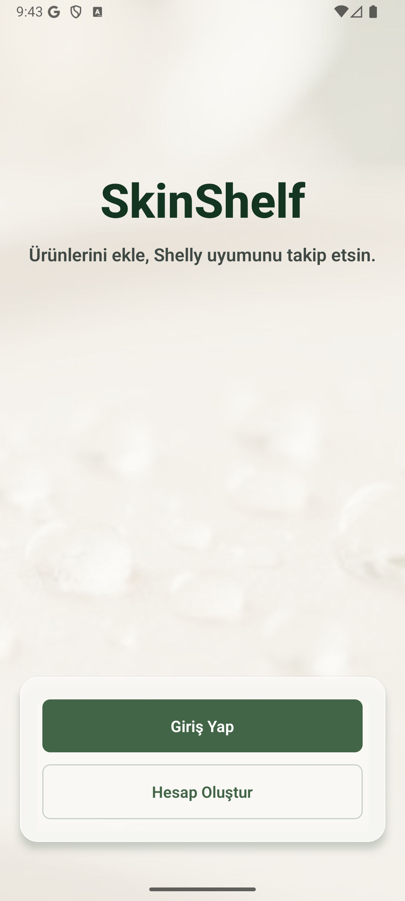
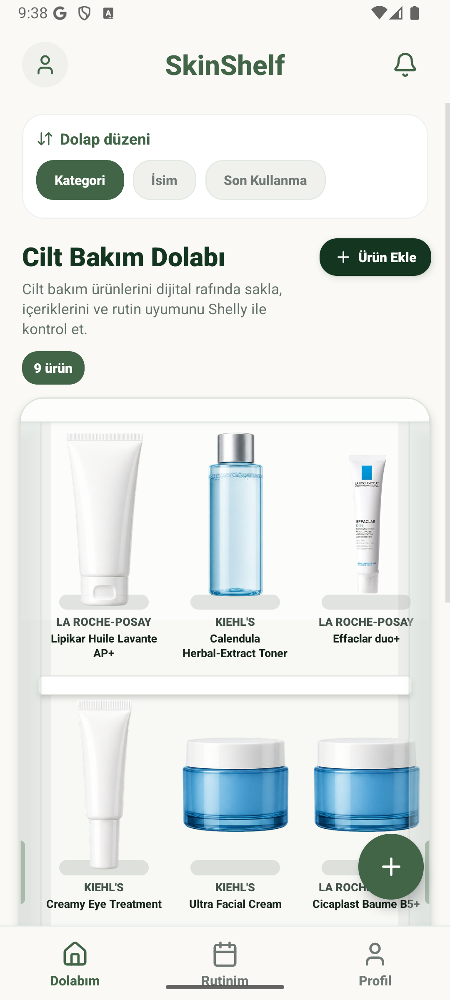
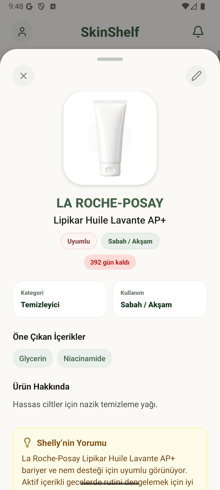
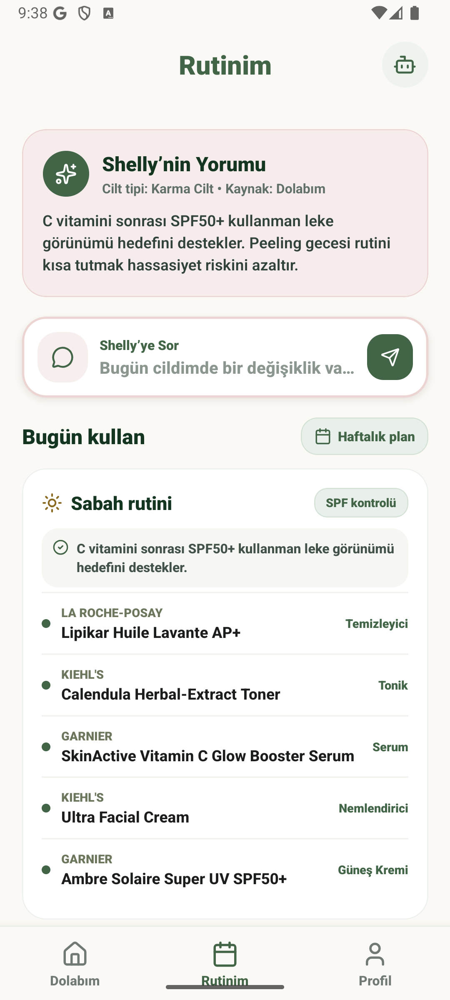
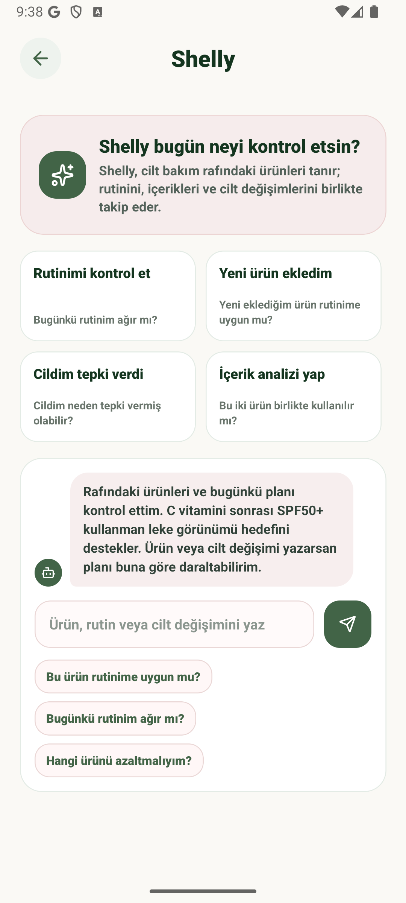

# Product Status ve Ekran Kanitlari

Sprint 2 sonunda urun, statik prototipten backend ve AI baglantili demo akislara gecti. Ornek bootcamp repolarindaki gibi ana uygulama ekranlari bu klasorde PNG olarak tutulur ve README icinde dogrudan gorunur.

## App Screenshots

| Login / Onboarding | Dolabim | Urun Detayi | Rutinim |
| --- | --- | --- | --- |
|  |  |  |  |

| Shelly | Profil | Barkod / Urun Ekleme |
| --- | --- | --- |
|  |  |  |

## Gosterilen Akislar

| Ekran/Akis | Sprint 2 degeri | Kod karsiligi |
| --- | --- | --- |
| Kayit ve onboarding | Kullanici ID'si ile profil verisinin Supabase'e yazilmasi | `SignUpScreen`, `OnboardingScreen`, `userService` |
| Dolabim | Backend'den gelen urunlerin raf gorunumunde listelenmesi | `HomeScreen`, `ProductContext` |
| Barkod / manuel urun ekleme | Open Beauty Facts ve AI enrichment fallback'i | `ScannerScreen`, `ProductReviewScreen`, `openBeautyFactsService` |
| Urun detayi | Aktif/pasif rutin kullanimi switch'i | `ProductDetailScreen`, `ProductService.java` |
| Rutinim | Dolaptaki aktif urunlere gore gunluk/haftalik rutin | `RoutineScreen`, `routinePlanner` |
| Shelly | Chat hafizasi ve dolap baglamiyla cevap | `AssistantScreen`, `AssistantService` |
| Cilt takibi | Fotograf notu, analiz ve haftalik ozet | `SkinTrackingScreen`, `SkinLogController` |
| Bildirimler | Rutin ve urun takip sinyalleri | `NotificationsScreen`, `notificationService` |

## Sonraki Guncelleme Notu

Emulator uzerinden yeni ekran goruntuleri alindiginda ayni dosya adlari korunarak bu klasordeki PNG'ler guncellenebilir. README linkleri sabit kalacagi icin GitHub ana sayfasinda ek is gerektirmez.

