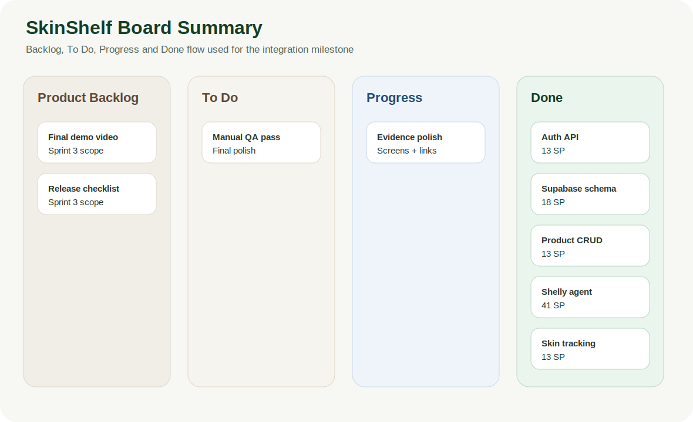
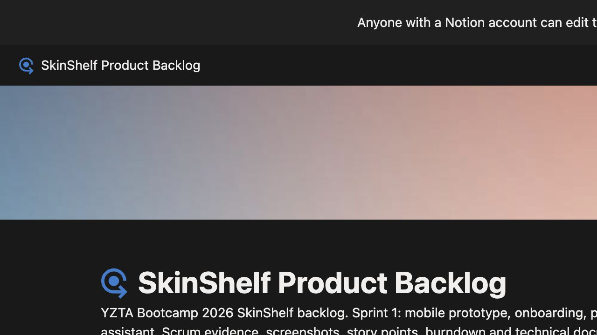

# Sprint 2 Board ve Backlog Takibi

Sprint 2 backlog'u Notion board uzerinden takip edildi. Ornek bootcamp repolarinda Trello/Asana/Miro board ekran goruntuleri README icine gomuluyor; SkinShelf tarafinda board linki kok README'de ve bu klasorde referanslanir.

## Notion Board Ekran Goruntuleri

Asagidaki gorseller 20 Temmuz 2026'da canli Notion Product Backlog sayfasindan alinmistir. GitHub tarafinda SVG ozetin yaninda gercek board ekran kaniti olarak tutulur.

| Board view | Full page capture |
| --- | --- |
|  |  |

## Board Kolon Mantigi

| Kolon | Anlam |
| --- | --- |
| Product Backlog | Sonraki sprintlere veya kapsam disina ayrilan fikirler |
| To Do | Sprint hedefi icine alinmis ama baslanmamis kartlar |
| Progress | Gelistirmesi devam eden teknik veya tasarim kartlari |
| Done | Kod, test ve dokumantasyon karsiligi tamamlanmis kartlar |

## Sprint 2 Kart Gruplari

| Grup | Ornek kartlar | Puan |
| --- | --- | ---: |
| Backend/API | Auth, profile, product CRUD, skin logs | 57 SP |
| Database | Supabase schema, Flyway migration, entity/repository duzeni | 18 SP |
| AI Agents | Shelly chat, ingredient analyzer, AI product enrichment | 41 SP |
| Mobile integration | Dolap/rutin senkronizasyonu, cilt takip ekranlari | 11 SP |
| Test/dokumantasyon | Build, backend test, kanit dosyalari | 3 SP |

Detayli puan dagilimi: [../sprint2-story-points.md](../sprint2-story-points.md)

## Kanit Notu

Daily scrum ve board ekran goruntuleri takim tarafindan Notion/Imgur uzerinden saklanir. GitHub tarafinda bu klasor, board'un hangi kolon/kart mantigiyla kullanildigini, puanlarin nasil dagitildigini ve canli Notion gorunumunun nasil takip edildigini aciklayan kalici teslim kanitidir.
