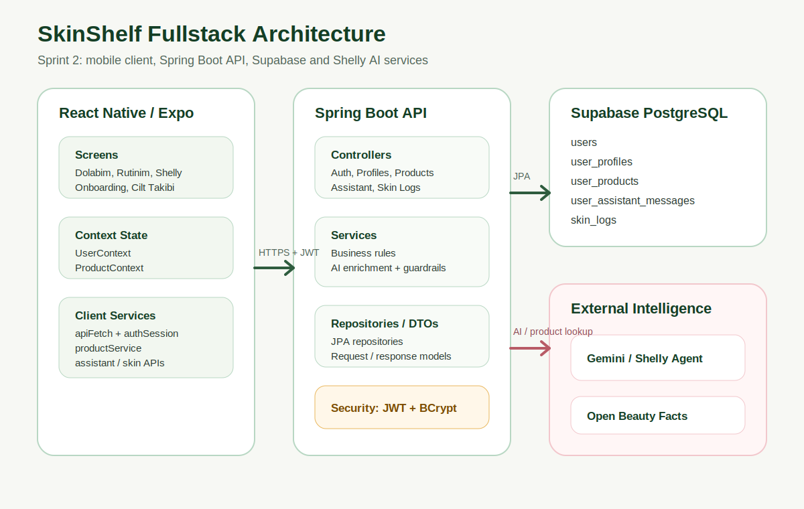

# Sistem Tasarimi

Sprint 2 sonunda proje, Sprint 1'deki frontend prototipinden fullstack mimariye gecti. Mobil katman ekran, context ve servis olarak ayrildi; backend katmani controller, service, repository ve entity/DTO olarak ayrildi.

## Mimari Diyagram

## Katmanlar

| Katman | Sorumluluk |
| --- | --- |
| Screens | Kullanici akisi, form ve ekran state'i |
| Context | Kullanici profili ve urun dolabi state yonetimi |
| Client services | Auth, product, assistant, skin analysis ve Open Beauty Facts istekleri |
| Controllers | HTTP sozlesmeleri ve request/response siniri |
| Services | Is kurallari, AI guardrail, enrichment ve rutin logic |
| Repositories | Supabase PostgreSQL uzerindeki kalici veri erisimi |
| AI services | Shelly sohbet, ingredient analizi, fotograf/cilt notu analizi |

## Sprint 2 Mimari Kararlari

- Supabase dogrudan mobil uygulamaya acilmadi; mobil istemci Spring Boot API uzerinden konusturuldu.
- Mobil tarafinda token yonetimi `authSession` ve ortak `apiFetch` uzerinden merkezilestirildi.
- Barkod verisi once Open Beauty Facts'ten alindi; eksik veri icin Gemini enrichment fallback'i eklendi.
- Shelly cevaplari sadece duz metin olarak degil, UI tarafinda kartlasabilecek yapili alanlarla tasarlandi.
- Rutin planlayici, kullanicinin dolabindaki aktif urunleri kaynak kabul edecek sekilde ayrildi.
- Cilt takibi ayri bir aggregate olarak modellendi; ileride gelisim grafigi ve haftalik ozet icin genisletilebilir hale getirildi.

