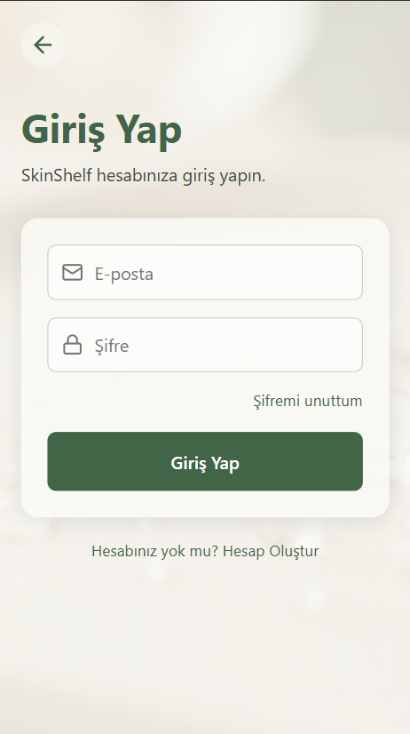
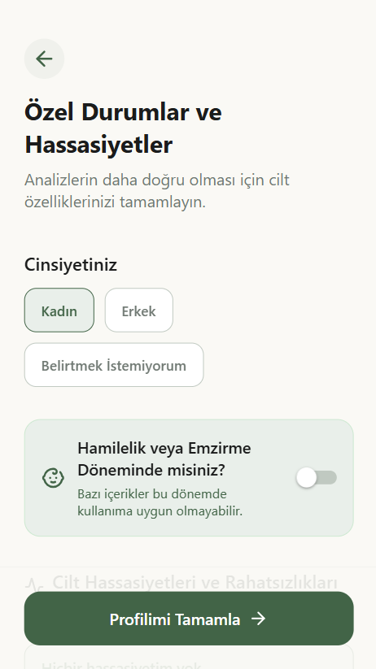
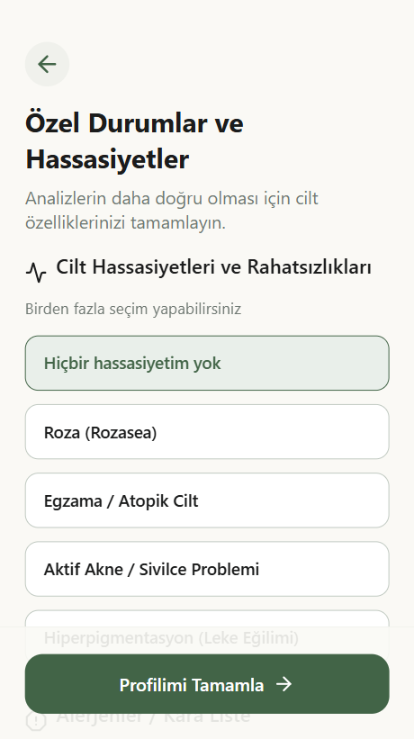

# 🌿 TGC-Team

> **YZTA Bootcamp 2026 Projesi**
>
> Yapay zekâ destekli kişiselleştirilmiş cilt bakım asistanı geliştirmeyi amaçlayan mobil uygulama projesi.

# 📌 Ürün Bilgileri

---

## Ürün İsmi : **SkinShelf**

---

## 👥 Takım Elemanları

| İsim                 | Rol           |
| -------------------- | ------------- |
| **Tuba Köten**       | Scrum Master  |
| **Gizem İlayda Koz** | Product Owner |
| **Ceren Sivri**      | Developer     |

---

# 📖 Ürün Açıklaması

Kullanıcıların sahip olduğu cilt bakım ürünlerini tek bir platform üzerinden yönetebilmelerini sağlayan, yapay zekâ destekli analizler ile daha bilinçli cilt bakım kararları almalarına yardımcı olan bir mobil uygulamadır. Kullanıcılar sahip oldukları ürünleri marka, içerik ve ürün bilgileriyle sisteme ekleyebilir; uygulama ise bu bilgileri kullanıcının cilt tipi, cilt hassasiyetleri ve bakım hedefleriyle birlikte değerlendirerek kişiselleştirilmiş sabah ve gece bakım rutinleri oluşturur. Ayrıca ürünlerin içerik uyumluluğunu analiz eder, birlikte kullanılması önerilmeyen kombinasyonlar için uyarılar sunar ve eksik aktif içeriklere göre yeni ürün önerilerinde bulunur. Kullanıcının rutin kullanım alışkanlıklarını zamanla öğrenerek önerilerini sürekli geliştirir ve ürünler tükenmeden önce hatırlatma bildirimleri göndererek cilt bakım sürecinin daha düzenli ve etkili bir şekilde yönetilmesini sağlar.

Uygulama;

- 🧴 Ürün içeriklerini analiz eder.
- 🤝 Ürünlerin birlikte kullanım uyumluluğunu değerlendirir.
- ✨ Kullanıcının cilt tipine uygun bakım rutini oluşturur.
- 🧠 Kullanım alışkanlıklarını öğrenerek önerilerini zamanla kişiselleştirir.
- 🔔 Ürünler tükenmeden önce hatırlatma bildirimleri gönderir.

Amacı, kullanıcıların cilt bakım süreçlerini daha bilinçli, güvenli ve kişiselleştirilmiş hale getirmektir.

---

# 🚀 Ürün Özellikleri

## 🤖 Yapay Zekâ Özellikleri

- İçerik (Ingredient) analizi
- Ürün uyumluluk analizi
- Cilt tipine özel sabah rutini oluşturma
- Cilt tipine özel gece rutini oluşturma
- Yapay zekâ destekli ürün önerileri
- Yapay zekâ sohbet asistanı
- Kullanım alışkanlıklarına göre kişiselleştirilmiş öneriler

---

## 📱 Uygulama Özellikleri

- Cilt profili oluşturma
- Kişisel ürün dolabı
- Ürün ekleme, düzenleme ve silme
- Geçmiş analizleri görüntüleme
- Bakım rutini yönetimi
- Ürün tükenme hatırlatmaları
- Günlük bakım bildirimleri

---

## ⭐ Opsiyonel Özellikler

- Yüz analizi
- Cilt gelişiminin dönemsel takibi
- AI destekli fotoğraf analizi
- Barkod ile ürün ekleme
- QR kod ile ürün ekleme
- Favori ürünler
- Çoklu dil desteği
- Topluluk bölümü

---

# 🎯 Hedef Kitle

Bu proje aşağıdaki kullanıcı gruplarına yönelik geliştirilmektedir:

- Cilt bakımına ilgi duyan bireyler
- Birden fazla cilt bakım ürünü kullanan kullanıcılar
- Ürün içeriklerini bilinçli şekilde analiz etmek isteyen kişiler
- Cilt tipine uygun bakım rutini oluşturmak isteyen kullanıcılar
- Cilt bakımına yeni başlayan bireyler
- Yoğun yaşam temposu nedeniyle bakım rutinlerini düzenli takip etmek isteyen kullanıcılar
- Yapay zekâ destekli kişiselleştirilmiş bakım deneyimi arayan kullanıcılar

---

# 🎯 Proje Amacı

Kullanıcıların sahip oldukları cilt bakım ürünlerini daha bilinçli kullanmalarını sağlamak, ürün içeriklerini yapay zekâ ile analiz etmek, kişiye özel bakım rutinleri oluşturmak ve cilt bakım sürecini daha kolay, güvenli ve etkili hale getirmektir.

## Product Backlog URL

Product Backlog Notion üzerinde tutulmaktadır.

[Notion Product Backlog](https://app.notion.com/p/38a7261335df8032a91bc8f9f21c1631?v=38a7261335df80499299000c888d5a9d)

Sprint 1'de backlog; kullanıcı hikayeleri, UI/UX tasarımı, kimlik doğrulama, cilt profili, ürün yönetimi, AI analiz modülleri, backend, database, test, dokümantasyon ve sunum başlıklarına ayrılmıştır.

# 🧩 Sistem Tasarımı

## UML Diyagramı

Uygulamanın veri modelini ve sınıflar arası ilişkileri gösteren UML class diyagramı, mevcut kod tabanı (`src/types.ts`, `src/context/*`, `src/services/*`) esas alınarak oluşturulmuştur.

**Mevcut varlıklar (kodda uygulanmış):**
- `User` — kimlik doğrulama bilgisi (`authService`)
- `UserProfile` — cilt tipi, hassasiyetler, onboarding durumu (`UserContext`)
- `Product` — dolaptaki ürün bilgisi (`ProductContext`, `productService`)

**Planlanan varlıklar (Sprint 2–3 kapsamında, henüz kodda yok):** `Routine`, `SkinAnalysis`, `ProgressEntry`. Diyagramda bunlar kesikli çizgiyle gösterilmiştir; geliştirildikçe diyagram güncellenmelidir.

## Akış Şemaları (Flow Charts)

Uygulamanın temel kullanıcı akışları, `RootNavigator.tsx` ve ekranlardaki `navigate()` / `replace()` çağrıları esas alınarak çıkarılmıştır — yani şema kod ile birebir doğrulanmıştır.

**Kapsanan akışlar:**
1. **Kimlik Doğrulama & Onboarding** — Login → SignIn/SignUp → SkinType → SkinConditions → MainTabs
2. **Ürün Tarama & Dolaba Ekleme** — Home → Scanner (Barkod | Fotoğraf) → `productService.scanProduct()` → ProductReview → MainTabs; ayrıca Home → ProductDetail
3. **Profil Düzenleme & Çıkış** — Profile → Login (çıkış) veya Profile → SkinType → SkinConditions → MainTabs (cilt tipini düzenleme)

> Not: `Routine`, `SkinAnalysis`, `ProgressEntry` ekranları henüz kodda olmadığı için bu şemaya dahil edilmedi. Sprint 2–3'te bu ekranlar geliştirildiğinde şema güncellenmelidir.

## 📌 Sprint - 1

### Sprint Notları

- React Native, Expo SDK 54 ve TypeScript ile mobil uygulama iskeleti kuruldu.
- `src/` altında `screens`, `navigation`, `services` ve `context` katmanları oluşturuldu.
- Kullanıcının hesap oluşturma, giriş yapma, cilt tipi seçme ve özel cilt durumlarını belirtme akışları tasarlandı.
- Kişisel ürün dolabı, ürün detay sayfası, ürün ekleme ve ürün inceleme ekranları hazırlandı.
- AI analiz, barkod tarama ve fotoğraf çekim akışları için prototip ekranlar oluşturuldu.
- Form ekranlarında klavye odaklanma ve buton tıklama problemleri giderildi.
- UML diyagramı ve kullanıcı akış şeması README'ye eklendi.

### Sprint İçinde Tamamlanması Tahmin Edilen Puan

> **Eklenecek:** Notion backlog üzerindeki story point değerleri netleştiğinde Sprint 1 hedef puanı buraya yazılacak.

Sprint 1 için hedeflenen ana kapsam; proje iskeleti, temel mobil ekranlar, onboarding akışı, ürün dolabı prototipi, AI analiz prototip ekranları ve proje dokümantasyonudur.

### Puan Tamamlama Mantığı

Backlog 3 sprintlik geliştirme sürecine göre parçalanmıştır. Sprint 1'de ürün fikrini somutlaştıran temel kullanıcı akışları, görsel tasarım, mobil mimari ve demo edilebilir prototip ekranlarına öncelik verilmiştir. AI servisleri, gerçek backend entegrasyonu, kalıcı veri katmanı ve gelişmiş rutin önerileri Sprint 2-3 kapsamına aktarılmıştır.

> **Eklenecek:** Toplam backlog puanı, Sprint 1 hedef puanı ve Sprint 1 tamamlanan puanı Notion board puanlarıyla birlikte güncellenecek.

### Backlog Düzeni ve Story Seçimleri

Backlog story bazında düzenlenmiştir. Notion üzerindeki Product Backlog'da aşağıdaki ana kartlar bulunmaktadır:

- User Story & Analiz
- UI/UX Tasarımı
- Authentication
- Cilt Profili Modülü
- Ürün Yönetimi
- Ingredient Analyzer Agent
- Compatibility Checker Agent
- Recommendation Agent
- Routine Planner Agent
- AI Chat
- Analiz Sonucu
- Geçmiş Analizler
- Bildirimler
- Backend
- Database
- AI Servisleri
- Mobil
- Deployment
- Test
- Dokümantasyon
- Sunum
- Opsiyonel Özellikler

Sprint 1'de öncelik; uygulama iskeleti, kullanıcı giriş/onboarding akışı, ürün dolabı arayüzü, AI analiz prototipi ve proje dokümantasyonuna verilmiştir.

### Daily Scrum

Daily scrum toplantıları ekip uygunluğuna göre çevrim içi iletişim kanalları üzerinden yürütülecektir.

- Daily scrum kanıt klasörü: [Project_Management_Files/Sprint_1/Daily_Scrum](Project_Management_Files/Sprint_1/Daily_Scrum)
- **Eklenecek:** WhatsApp, Discord veya Slack daily scrum ekran görüntüleri.
- **Eklenecek:** Günlük blocker ve karar notları.

### Sprint Board Update

Sprint board Notion Product Backlog üzerinden takip edilmektedir.

- Product Backlog: [Notion Board](https://app.notion.com/p/38a7261335df8032a91bc8f9f21c1631?v=38a7261335df80499299000c888d5a9d)
- Sprint board kanıt klasörü: [Project_Management_Files/Sprint_1/Sprint_Board](Project_Management_Files/Sprint_1/Sprint_Board)
- **Eklenecek:** Sprint başlangıcı board ekran görüntüsü.
- **Eklenecek:** Sprint ortası board ekran görüntüsü.
- **Eklenecek:** Sprint sonu board ekran görüntüsü.

### Ürün Durumu

Sprint 1 sonunda uygulama; giriş, hesap oluşturma, cilt profili oluşturma, AI analiz prototipi, barkod/fotoğraf tarama prototipi, dijital ürün dolabı, ürün detay ve profil ekranlarını gösterebilir durumdadır.

#### 1. Giriş ve Hesap Oluşturma Akışı

Kullanıcıların uygulamaya güvenli bir şekilde dahil olmasını, cilt tipi ve özel hassasiyetlerini belirleyerek kişiselleştirilmiş bir deneyim başlatmasını sağlayan onboarding adımlarıdır.

  
  

Kullanıcı kayıt aşamasında temel bilgilerini ve cilt hassasiyetlerini sisteme ekleyerek sonraki AI analizleri için profil girdisi oluşturur.

#### 2. Yapay Zeka Analiz ve Tarama Akışı

Kullanıcıların kamera veya galeri aracılığıyla cilt fotoğraflarını yükledikleri ya da kozmetik ürün barkodlarını tarattıkları prototip akıştır.

| AI Cilt Analizi | Barkod Tarayıcı | Fotoğraf Çekim |
| :---: | :---: | :---: |
|  |  |  |

> Sprint 1 teknik notu: Bu akışta servis katmanı şu an mock/prototip cevap üretmektedir. Gemini 2.5 Flash veya gerçek backend bağlantısı Sprint 2 kapsamına alınmıştır.

#### 3. Dijital Dolap ve Ürün Yönetimi Akışı

Kullanıcıların sahip oldukları kozmetik ürünleri dijital ortama aktardıkları ve ürün detaylarını inceledikleri yönetim panelidir.

| Dijital Dolabım | Ürün Detay & Analiz | Ürün Ekleme | Ürün Detay Girişi |
| :---: | :---: | :---: | :---: |
|  |  |  |  |

Kullanıcılar ürün kategorisi, kullanım zamanı, aktif içerikler ve ürün detaylarını görüntüleyebilir. AI analiz metinleri Sprint 1'de arayüz seviyesinde temsil edilmektedir.

#### 4. Profil ve Ayarlar

| Kullanıcı Profili |
| :---: |
|  |

Cilt profili güncelleme, hesap ayarları ve çıkış akışı bu bölümde temsil edilir.

### Sprint Review

Sprint 1 sonunda ekip, uygulamanın temel mobil iskeletini ve ana kullanıcı akışlarını değerlendirmiştir.

Tamamlanan başlıklar:

- React Native/Expo proje kurulumu
- Temel navigasyon yapısı
- Login, Sign In ve Sign Up ekranları
- Cilt tipi ve özel durum onboarding ekranları
- Ana ekran ve AI rutin sıralaması prototipi
- Ürün dolabı, ürün detay, ürün ekleme ve ürün inceleme ekranları
- Scanner, barkod ve fotoğraf prototip akışları
- Profil ekranı
- UML ve flow chart dokümantasyonu

Değerlendirilen konular:

- Ürünün hedef kullanıcı problemi netleşti.
- Ana ekranlar demo edilebilir seviyeye getirildi.
- AI deneyiminin kullanıcıya nasıl sunulacağı belirlendi.
- Backend, database ve gerçek AI servis bağlantılarının sonraki sprintlere bırakılması kararlaştırıldı.

### Sprint Review Katılımcıları

- Tuba Köten
- Gizem İlayda Koz
- Ceren Sivri

### Sprint Retrospective

İyi gidenler:

- Ürün fikri ve hedef kitle netleştirildi.
- Mobil uygulamanın temel mimarisi erken aşamada kuruldu.
- Ana kullanıcı akışları görsel olarak somutlaştırıldı.
- Ekran tasarımlarında tutarlı bir görsel dil oluşturuldu.

Zorlayanlar:

- AI kapsamının geniş olması nedeniyle Sprint 1'de gerçek servis entegrasyonu yerine prototip akış önceliklendirildi.
- Backend ve kalıcı veri katmanı henüz bağlanmadığı için bazı ekranlarda mock veri kullanılmaktadır.
- Product Backlog puanları, daily scrum kanıtları ve sprint board görselleri README'ye henüz eklenmemiştir.

Sonraki sprint için kararlar:

- Gemini 2.5 Flash veya seçilecek AI servisi gerçek analiz akışına bağlanacak.
- Ürün tarama/ekleme akışında mock cevaplar gerçek servis cevabıyla değiştirilecek.
- Kullanıcı ürün dolabı için kalıcı veri katmanı tasarlanacak.
- Product Backlog story point değerleri README'ye eklenecek.
- Daily scrum ve sprint board kanıtları düzenli olarak GitHub'a yüklenecek.

### Sprint 2'ye Aktarılan İşler

- Gerçek AI ingredient analiz servisi
- Ürün uyumluluk analiz motoru
- Rutin öneri algoritması
- Backend/database entegrasyonu
- Kalıcı kullanıcı ve ürün verisi
- Geçmiş analizler ekranı
- Bildirim ve ürün tükenme hatırlatmaları
- Test ve hata yönetimi
- Deployment/canlı demo hazırlığı

### Sprint 1 Doküman Klasörleri

- [Daily Scrum](Project_Management_Files/Sprint_1/Daily_Scrum)
- [Sprint Board Updates](Project_Management_Files/Sprint_1/Sprint_Board)
- [Product Screenshots](Project_Management_Files/Sprint_1/Product_Screenshots)
- [Review and Retrospective](Project_Management_Files/Sprint_1/Review_and_Retrospective)

---
