# 🌿 TGC-Team

> **YZTA Bootcamp 2026 Projesi**
>
> Yapay zekâ destekli kişiselleştirilmiş cilt bakım asistanı geliştirmeyi amaçlayan mobil uygulama projesi.

# 📌 Ürün Bilgileri

### **Ürün İsmi**: **`SkinShelf`**

---

## 👥 Takım Elemanları

| İsim                 | Rol           |
| -------------------- | ------------- |
| **Tuba Köten**       | Scrum Master  |
| **Gizem İlayda Koz** | Product Owner |
| **Ceren Sivri**      | Developer     |

---

# 📖 Ürün Açıklaması

Kullanıcıların sahip olduğu cilt bakım ürünlerini tek bir platform üzerinden yönetebilmelerini sağlayan, yapay zekâ destekli analizler ile daha bilinçli cilt bakım kararları almalarına yardımcı olan bir mobil uygulamadır. Kullanıcılar sahip oldukları ürünleri marka, içerik ve ürün bilgileriyle sisteme ekleyebilir; uygulama ise bu bilgileri kullanıcının cilt tipi, cilt hassasiyetleri ve bakım hedefleriyle birlikte değerlendirerek kişiselleştirilmiş sabah ve gece bakım rutinleri oluşturur. Ayrıca ürünlerin içerik uyumluluğunu analiz eder, birlikte kullanılması önerilmeyen kombinasyonlar için uyarılar sunar ve eksik aktif içeriklere göre yeni ürün önerilerinde bulunur. Kullanıcının rutin kullanım alışkanlıklarını zamanla öğrenerek önerilerini sürekli geliştirir ve ürünler tükenmeden önce hatırlatma bildirimleri göndererek cilt bakım sürecinin daha düzenli ve etkili bir şekilde yönetilmesini sağlar.

Uygulama;

- 🧴 Ürün içeriklerini analiz eder.
- 🤝 Ürünlerin birlikte kullanım uyumluluğunu değerlendirir.
- ✨ Kullanıcının cilt tipine uygun bakım rutini oluşturur.
- 🧠 Kullanım alışkanlıklarını öğrenerek önerilerini zamanla kişiselleştirir.
- 🔔 Ürünler tükenmeden önce hatırlatma bildirimleri gönderir.

Amacı, kullanıcıların cilt bakım süreçlerini daha bilinçli, güvenli ve kişiselleştirilmiş hale getirmektir.

---

# 🚀 Ürün Özellikleri

## 🤖 Yapay Zekâ Özellikleri

- İçerik (Ingredient) analizi
- Ürün uyumluluk analizi
- Cilt tipine özel sabah rutini oluşturma
- Cilt tipine özel gece rutini oluşturma
- Yapay zekâ destekli ürün önerileri
- Yapay zekâ sohbet asistanı
- Kullanım alışkanlıklarına göre kişiselleştirilmiş öneriler

---

## 📱 Uygulama Özellikleri

- Cilt profili oluşturma
- Kişisel ürün dolabı
- Ürün ekleme, düzenleme ve silme
- Geçmiş analizleri görüntüleme
- Bakım rutini yönetimi
- Ürün tükenme hatırlatmaları
- Günlük bakım bildirimleri

---

## ⭐ Opsiyonel Özellikler

- Yüz analizi
- Cilt gelişiminin dönemsel takibi
- AI destekli fotoğraf analizi
- Barkod ile ürün ekleme
- QR kod ile ürün ekleme
- Favori ürünler
- Çoklu dil desteği
- Topluluk bölümü

---

# 🎯 Hedef Kitle

Bu proje aşağıdaki kullanıcı gruplarına yönelik geliştirilmektedir:

- Cilt bakımına ilgi duyan bireyler
- Birden fazla cilt bakım ürünü kullanan kullanıcılar
- Ürün içeriklerini bilinçli şekilde analiz etmek isteyen kişiler
- Cilt tipine uygun bakım rutini oluşturmak isteyen kullanıcılar
- Cilt bakımına yeni başlayan bireyler
- Yoğun yaşam temposu nedeniyle bakım rutinlerini düzenli takip etmek isteyen kullanıcılar
- Yapay zekâ destekli kişiselleştirilmiş bakım deneyimi arayan kullanıcılar

---

# 🎯 Proje Amacı

Kullanıcıların sahip oldukları cilt bakım ürünlerini daha bilinçli kullanmalarını sağlamak, ürün içeriklerini yapay zekâ ile analiz etmek, kişiye özel bakım rutinleri oluşturmak ve cilt bakım sürecini daha kolay, güvenli ve etkili hale getirmektir.

## Product Backlog URL

Product Backlog Notion üzerinde tutulmaktadır.

[Notion Product Backlog](https://app.notion.com/p/38a7261335df8032a91bc8f9f21c1631?v=38a7261335df80499299000c888d5a9d)

Sprint 1'de backlog; kullanıcı hikayeleri, UI/UX tasarımı, kimlik doğrulama, cilt profili, ürün yönetimi, AI analiz modülleri, backend, database, test, dokümantasyon ve sunum başlıklarına ayrılmıştır.

Sprint 2 backlog'u; kullanıcı akışları, UI/UX–veri entegrasyonu, kimlik doğrulama ve güvenlik mekanizmaları, cilt profili modülü, akıllı ürün dolabı (CRUD) servisleri, yapay zekâ (AI) destekli asistan ve analiz servisleri, Backend API geliştirmeleri, veritabanı tasarımı, güvenliği ve migration süreçleri, test ve hata ayıklama çalışmaları ile teknik dokümantasyon ve sprint kapanış sunumu başlıkları altında planlanmıştır.

# 🧩 Sistem Tasarımı

## UML Diyagramı

Uygulamanın veri modelini ve sınıflar arası ilişkileri gösteren UML class diyagramı, mevcut kod tabanı (`src/types.ts`, `src/context/*`, `src/services/*`) esas alınarak oluşturulmuştur.


**Mevcut varlıklar (kodda uygulanmış):**

- `User` — kimlik doğrulama bilgisi (`authService`)
- `UserProfile` — cilt tipi, hassasiyetler, onboarding durumu (`UserContext`)
- `Product` — dolaptaki ürün bilgisi (`ProductContext`, `productService`)

**Sprint 2–3 kapsamına ayrılan varlıklar:** `Routine`, `SkinAnalysis`, `ProgressEntry`. Diyagramda bunlar kesikli çizgiyle gösterilmiştir; ilgili modüller geliştirildikçe diyagram güncellenecektir.

## Akış Şemaları (Flow Charts)

Uygulamanın temel kullanıcı akışları, Sprint 1'de geliştirilen navigasyon yapısı ve Sprint 2–3 kapsamına ayrılan alt modüller birlikte düşünülerek çıkarılmıştır.

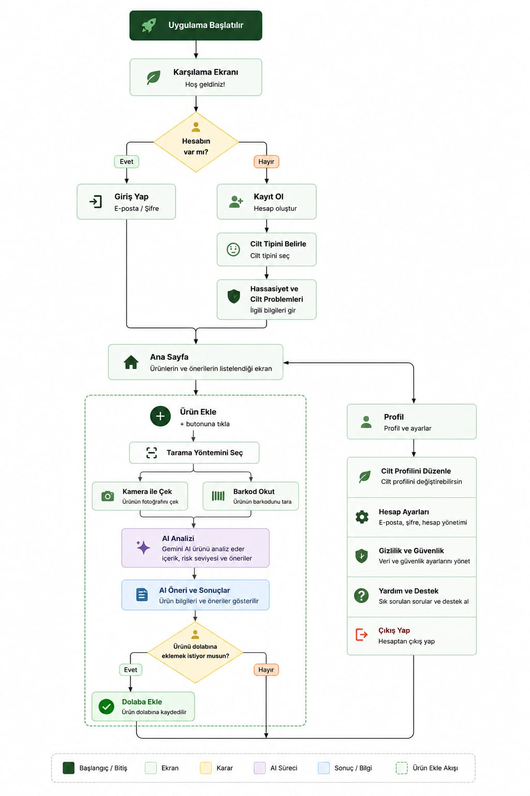

**Kapsanan akışlar:**

1. **Kimlik Doğrulama & Onboarding** — Login → SignIn/SignUp → Onboarding → MainTabs
2. **Ürün Tarama & Dolaba Ekleme** — Home → Scanner (Barkod | Fotoğraf) → `productService.scanProduct()` → ProductReview → MainTabs; ayrıca Home → ProductDetail
3. **Profil Düzenleme & Çıkış** — Profile → Login (çıkış) veya Profile → Onboarding → MainTabs (cilt profilini düzenleme)
4. **Sprint 2–3 Profil Alt Akışları** — hesap ayarları, gizlilik/güvenlik, yardım/destek ve gelişmiş profil yönetimi

> Not: `Routine`, `SkinAnalysis`, `ProgressEntry` ekranları Sprint 2–3 kapsamına ayrıldığı için bu Sprint 1 şemasında temel akış seviyesinde temsil edilmiştir.

## Teknik Mimari

Sprint 1'de mobil uygulama katmanlı bir yapı ile organize edilmiştir. Navigasyon, ekranlar, context state yönetimi ve servis katmanı birbirinden ayrılmıştır. Backend, database ve Gemini AI bağlantıları Sprint 2 entegrasyon hedefi olarak planlanmıştır.

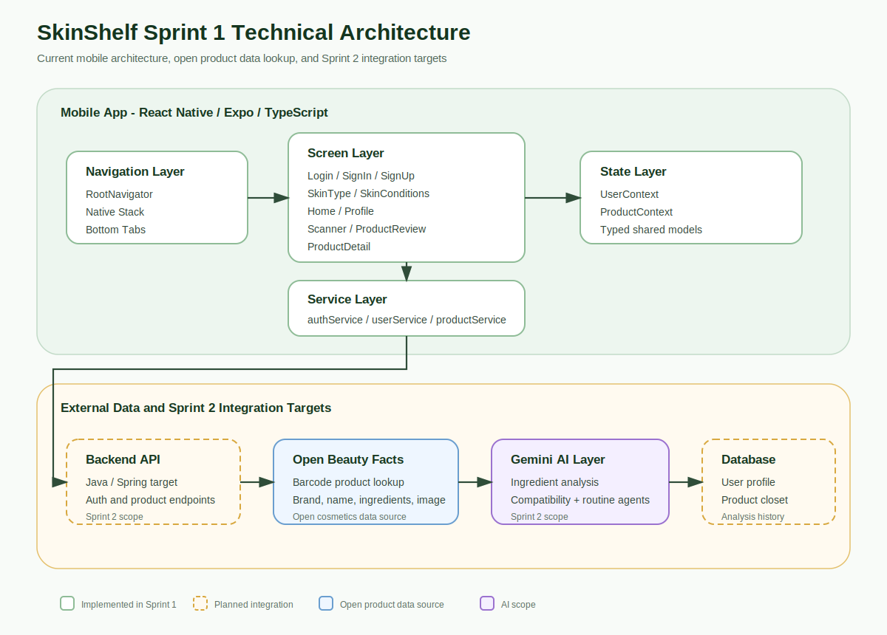

**Kod yapısı:**

- `src/screens`: Uygulama ekranları ve kullanıcı arayüzü akışları
- `src/navigation`: Stack ve tab navigasyon yapısı
- `src/context`: Kullanıcı profili ve ürün dolabı için global state yönetimi
- `src/services`: Backend ve AI servislerine bağlanacak servis katmanı
- `src/types.ts`: Ortak TypeScript veri modelleri ve navigation tipleri

**Sprint 1 teknik kararları:**

- Mobil istemci React Native, Expo SDK 54 ve TypeScript ile geliştirilecektir.
- Frontend akışı önce tamamlanacak, backend entegrasyonu Sprint 2'de yapılacaktır.
- Backend için Java/Spring seçeneği değerlendirilmiş ve uygun bulunmuştur.
- AI analiz akışı Gemini API servis katmanına uygun şekilde planlanmıştır.

AI servis planı: [AI_Service_Plan.md](Project_Management_Files/Sprint_1/System_Design/AI_Service_Plan.md)

Ürün veri kaynağı planı: [Product_Data_Source_Plan.md](Project_Management_Files/Sprint_1/System_Design/Product_Data_Source_Plan.md)

**Barkod / açık ürün verisi kararı:**

- Barkod ile ürün tanıma için Open Beauty Facts açık kozmetik ürün verisi birincil kaynak olarak seçilmiştir.
- `src/services/openBeautyFactsService.ts` ile barkoddan ürün adı, marka, içerik ve kategori alanlarını ProductReview ekranına taşıyacak servis iskeleti eklenmiştir.
- Ürün görselleri açık kaynak fotoğraf alanından bağımsız tutulmuştur. Raf görünümü için `src/services/productVisualCatalog.ts` üzerinden marka + ürün adına göre ekip tarafından hazırlanmış PNG/cutout katalog eşleşmesi yapılır; eşleşme yoksa kategori bazlı temsili PNG gösterilir.
- Barkod bulunamadığında fotoğraf/etiket okuma, Gemini ile içerik çıkarımı ve kullanıcı onaylı manuel düzenleme fallback akışı Sprint 2 kapsamına alınmıştır.

## Kurulum ve Çalıştırma

Projeyi lokal ortamda çalıştırmak için:

```bash
npm install
npm run dev
```

TypeScript build/type kontrolü için:

```bash
npm run build
```

Diğer Expo komutları:

```bash
npm run android
npm run ios
npm run web
```

## 📚 Sprintler

Proje yönetimi dosyaları sprint bazlı olarak [Project_Management_Files](Project_Management_Files) klasöründe tutulmaktadır.

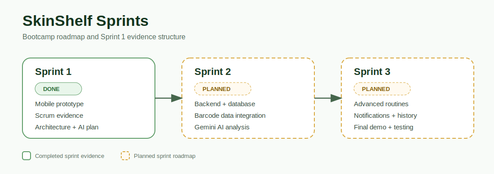

| Sprint   | Durum      | Odak                                                                                    | Kanıt                                         |
| -------- | ---------- | --------------------------------------------------------------------------------------- | --------------------------------------------- |
| Sprint 1 | Tamamlandı | Mobil prototip, temel ekranlar, ürün dolabı, AI/tarama demo akışı, Scrum dokümantasyonu | [Sprint_1](Project_Management_Files/Sprint_1) |
| Sprint 2 | Tamamlandı | Backend, database, Open Beauty Facts barkod akışı, Gemini AI analiz servisleri          | [Sprint_2](Project_Management_Files/Sprint_2) |
| Sprint 3 | Planlandı  | Gelişmiş rutin önerileri, analiz geçmişi, bildirimler, final demo ve testler            | [Sprint_3](Project_Management_Files/Sprint_3) |

Sprint 1 kanıt indeksi: [Project_Management_Files/Sprint_1/README.md](Project_Management_Files/Sprint_1/README.md)

Sprint 2 kanıt indeksi: [Project_Management_Files/Sprint_2/README.md](Project_Management_Files/Sprint_2/README.md)

## 📌 Sprint - 1

### Sprint Notları

- React Native, Expo SDK 54 ve TypeScript ile mobil uygulama iskeleti kuruldu.
- `src/` altında `screens`, `navigation`, `services` ve `context` katmanları oluşturuldu.
- Kullanıcının hesap oluşturma, giriş yapma ve 7 adımlı cilt profili onboarding akışları tasarlandı.
- Kişisel ürün dolabı raflı envanter ekranına ayrıldı; Rutinim sekmesi dolaptaki ürünlerden bugünün ve haftanın sabah/akşam rutinini oluşturacak şekilde hazırlandı.
- Shelly ekranı, boş chatbot yerine ürün/rutin/cilt değişimi odaklı hızlı aksiyonlar sunan cilt danışmanı olarak eklendi.
- Dolap görsel altyapısı gerçek ürün PNG/cutout katalog mantığına ayrıldı; Sprint 1'de Effaclar örneği lokal cutout olarak, diğer ürünler temsili kategori PNG'leriyle gösterildi.
- Açık ürün verisi entegrasyonu ürün adı/marka/içerik için tutuldu; ürün görsellerinin uygulama açılışı öncesi manuel DB/cutout katalog ile büyütülmesi Sprint 2-3 hedefi olarak ayrıldı.
- AI analiz, barkod tarama ve fotoğraf çekim akışları için prototip ekranlar oluşturuldu.
- Form ekranlarında klavye odaklanma ve buton tıklama problemleri giderildi.
- UML diyagramı ve kullanıcı akış şeması README'ye eklendi.

### Sprint İçinde Tamamlanması Tahmin Edilen Puan

Sprint 1 puanlaması Fibonacci benzeri story point yaklaşımıyla yapılmıştır.

- Sprint 1 hedefi: **115 SP**
- Sprint 1 tamamlanan: **97 SP**
- Sprint 1 kalan / To Do: **18 SP**
- Sprint 1 tamamlanma oranı: **%84**

Sprint 1 için hedeflenen ana kapsam; proje iskeleti, temel mobil ekranlar, onboarding akışı, ürün dolabı prototipi, AI analiz prototip ekranları ve proje dokümantasyonudur.

Story point dağılımı: [sprint1-story-points.md](Project_Management_Files/Sprint_1/Sprint_Board/sprint1-story-points.md)

Notion Point alanı güncellemesi: [notion-point-update.md](Project_Management_Files/Sprint_1/Sprint_Board/notion-point-update.md)

### Puan Tamamlama Mantığı

Backlog 3 sprintlik geliştirme sürecine göre parçalanmıştır. Sprint 1'de ürün fikrini somutlaştıran temel kullanıcı akışları, görsel tasarım, mobil mimari ve demo edilebilir prototip ekranlarına öncelik verilmiştir. AI servisleri, gerçek backend entegrasyonu, kalıcı veri katmanı ve gelişmiş rutin önerileri Sprint 2-3 kapsamına aktarılmıştır.

Sprint 1 story point değerlendirmesinde 115 SP'lik sprint kapsamının 97 SP'lik bölümü tamamlanmış, backend/database tarafındaki 18 SP'lik bölüm sonraki geliştirme akışına bırakılmıştır.

### Backlog Dağıtma Mantığı ve Story Seçimleri

Backlog story bazında düzenlenmiştir. Notion üzerindeki Product Backlog'da aşağıdaki ana kartlar bulunmaktadır:

- User Story & Analiz
- UI/UX Tasarımı
- Authentication
- Cilt Profili Modülü
- Ürün Yönetimi
- Ingredient Analyzer Agent
- Compatibility Checker Agent
- Recommendation Agent
- Routine Planner Agent
- AI Chat
- Analiz Sonucu
- Geçmiş Analizler
- Bildirimler
- Backend
- Database
- AI Servisleri
- Mobil
- Deployment
- Test
- Dokümantasyon
- Sunum
- Opsiyonel Özellikler

Sprint 1'de öncelik; uygulama iskeleti, kullanıcı giriş/onboarding akışı, ürün dolabı arayüzü, AI analiz prototipi ve proje dokümantasyonuna verilmiştir.

### Daily Scrum

Daily scrum toplantıları ekip uygunluğuna göre WhatsApp yazışmaları ve sesli görüşme üzerinden yürütülmüş ve Imgur'da toplanmıştır: [Sprint 1 Daily Scrum Chats](https://imgur.com/a/KJmUkwi)

### Sprint Board Update

Sprint board Notion Product Backlog üzerinden takip edilmektedir.

- Product Backlog: [Notion Board](https://app.notion.com/p/38a7261335df8032a91bc8f9f21c1631?v=38a7261335df80499299000c888d5a9d)
- Sprint board kanıt klasörü: [Project_Management_Files/Sprint_1/Sprint_Board](Project_Management_Files/Sprint_1/Sprint_Board)
- Sprint sonu board ekran görüntüsü: [sprint1-board-end.png](Project_Management_Files/Sprint_1/Sprint_Board/sprint1-board-end.png)

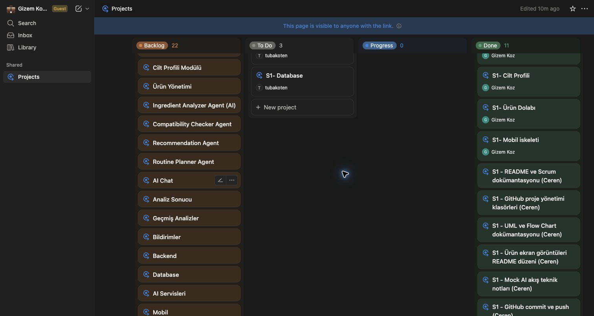

Sprint 1 ilerleme kanıtı, Notion board son durum görüntüsü ve daily scrum kayıtlarıyla birlikte belgelenmiştir.

### Sprint Burndown / Tamamlanma Özeti

Sprint 1 sonunda story point bazlı ilerleme aşağıdaki gibidir:

| Kapsam           | Story Point |
| ---------------- | ----------: |
| Sprint 1 hedefi  |      115 SP |
| Tamamlanan       |       97 SP |
| Kalan / To Do    |       18 SP |
| Tamamlanma oranı |         %84 |

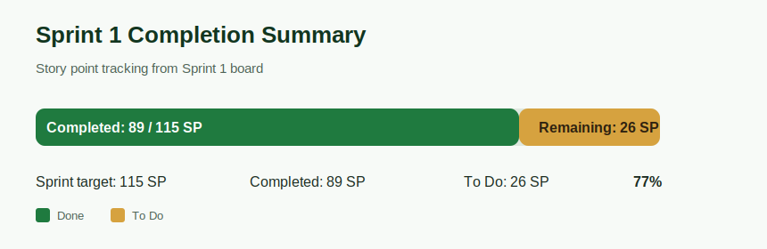

Sprint 1 ilerlemesi Notion board, daily scrum kayıtları ve sprint sonu tamamlanma özeti üzerinden belgelenmiştir.

### Ürün Durumu

Sprint 1 sonunda uygulama; animasyonlu giriş, hesap oluşturma, 7 adımlı onboarding, AI analiz prototipi, barkod/fotoğraf tarama prototipi, raflı dijital ürün dolabı, ürün detayında Shelly yorumu, Rutinim günlük/haftalık planı, Shelly danışman ekranı ve profil ekranlarını gösterebilir durumdadır.

#### 1. Giriş ve Hesap Oluşturma Akışı

Kullanıcıların uygulamaya güvenli bir şekilde dahil olmasını ve Shelly'nin önerilerini kişiselleştirecek ilk profil girdilerini oluşturmasını sağlayan onboarding adımlarıdır.

 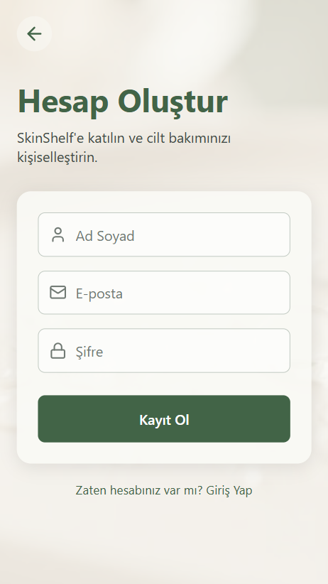 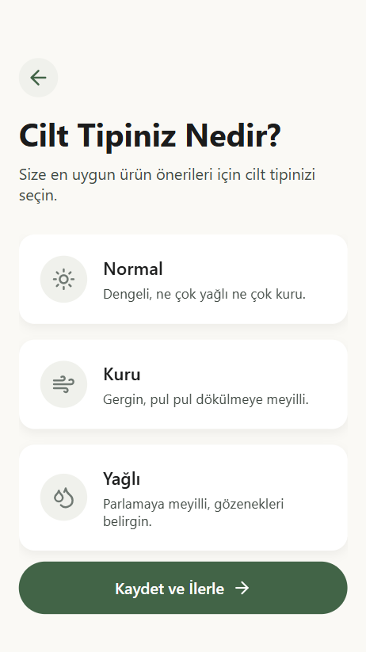

Kullanıcı kayıt aşamasında ad, yaş aralığı, cilt bakım deneyimi, cilt hissi, ana hedef, hassasiyet, mevcut rutin ve bildirim tercihlerini sisteme ekleyerek sonraki Shelly analizleri için profil girdisi oluşturur.

#### 2. Yapay Zeka Analiz ve Tarama Akışı

Kullanıcıların kamera veya galeri aracılığıyla cilt fotoğraflarını yükledikleri ya da kozmetik ürün barkodlarını tarattıkları Sprint 1 demo akışıdır.

|                     AI Cilt Analizi                      |                    Barkod Tarayıcı                    |                     Fotoğraf Çekim                      |
| :------------------------------------------------------: | :---------------------------------------------------: | :-----------------------------------------------------: |
| 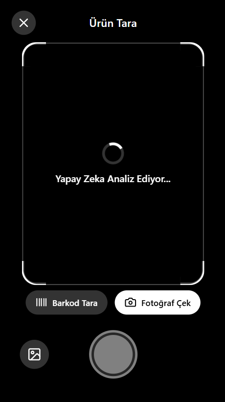 | 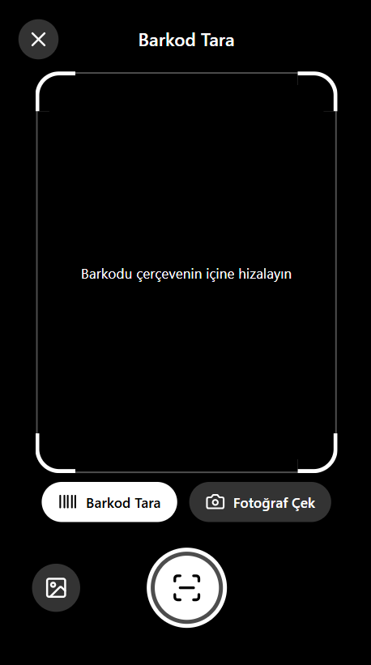 | 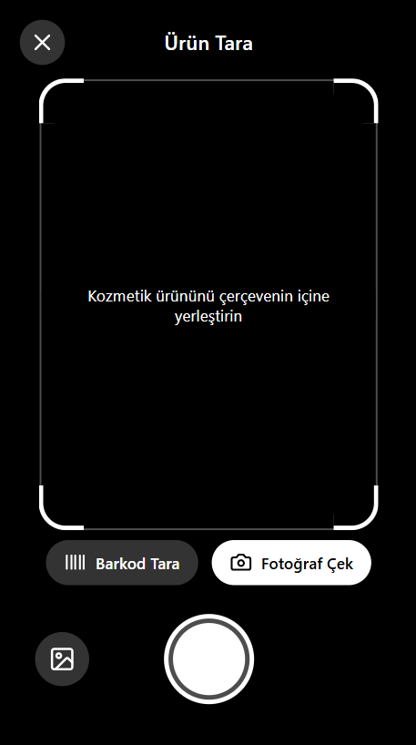 |

> Sprint 1 teknik notu: Bu akışta servis katmanı arayüz doğrulaması için demo veri üretmektedir. Gemini API ve gerçek backend bağlantısı Sprint 2 kapsamına alınmıştır.

#### 3. Dijital Dolap ve Ürün Yönetimi Akışı

Kullanıcıların sahip oldukları kozmetik ürünleri dijital ortama aktardıkları ve ürün detaylarını inceledikleri yönetim panelidir.

|                   Dijital Dolabım                    |                 Ürün Detay & Shelly Yorumu                 |                       Ürün Ekleme                        |                     Ürün Detay Girişi                     |
| :--------------------------------------------------: | :--------------------------------------------------------: | :------------------------------------------------------: | :-------------------------------------------------------: |
| 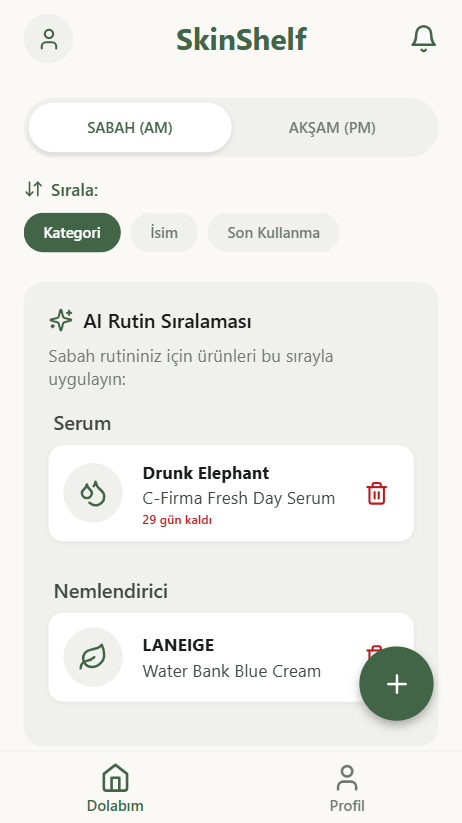 | 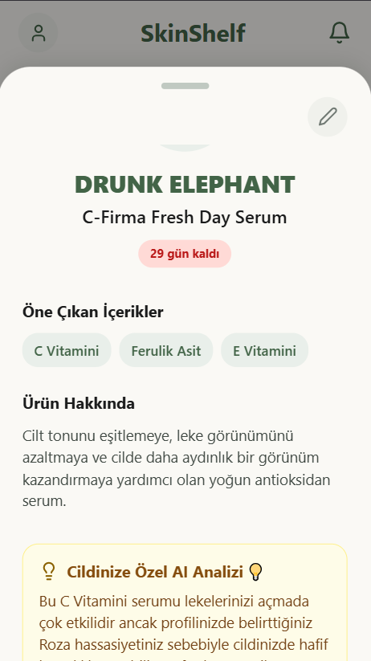 | 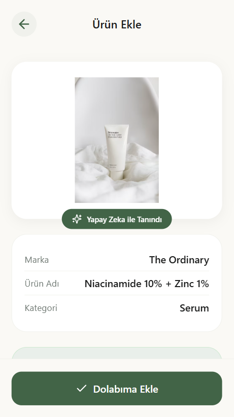 | 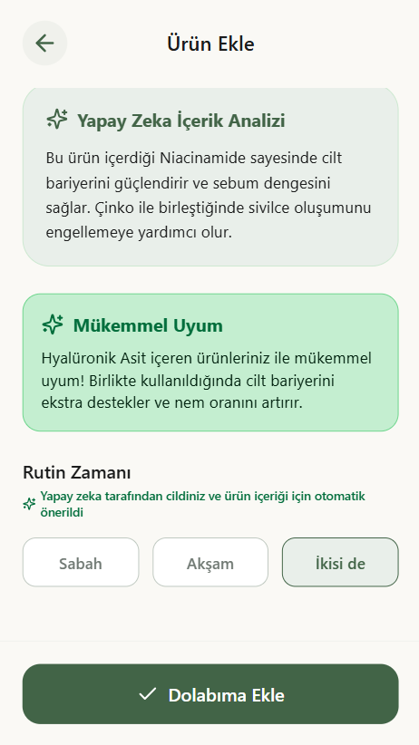 |

Dolap ekranı raflı dijital ürün dolabı olarak çalışır. Ürün görseli için önce ekip tarafından hazırlanan cutout katalog eşleşmesi kullanılır; katalogda ürün yoksa kategoriye göre temsili PNG gösterilir. Raf ekranı sade tutulur; ürünün aktif içerik, durum etiketi ve Shelly yorumu ürün detay ekranında gösterilir.

|                                                                         Android Dolabım                                                                          |                                                                      Android Haftalık Plan                                                                      |                                                                           Android Shelly                                                                            |                                                                          Android Profil                                                                          |
| :--------------------------------------------------------------------------------------------------------------------------------------------------------------: | :-------------------------------------------------------------------------------------------------------------------------------------------------------------: | :-----------------------------------------------------------------------------------------------------------------------------------------------------------------: | :--------------------------------------------------------------------------------------------------------------------------------------------------------------: |
|  |  |  |  |

Rutinim sekmesi, dolaptaki ürünleri kullanarak bugünün sabah/akşam rutinini ve tam ekran haftalık planı oluşturur. Shelly ekranı, “Rutinimi kontrol et”, “Yeni ürün ekledim”, “Cildim tepki verdi” ve “İçerik analizi yap” aksiyonlarıyla ürün/rutin uyumu danışmanı olarak prototiplenmiştir.

#### 4. Profil ve Ayarlar

|                   Kullanıcı Profili                   |
| :---------------------------------------------------: |
| 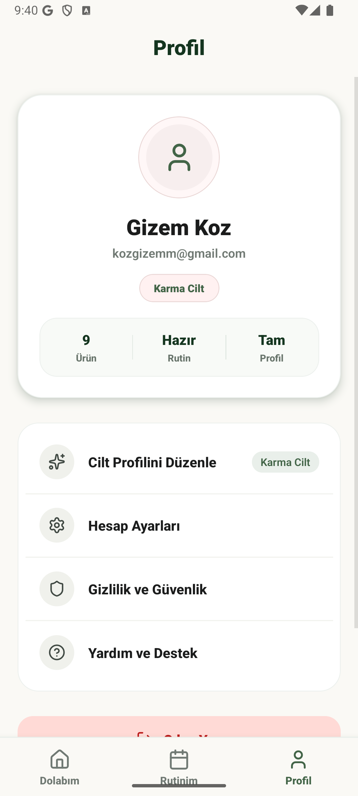 |

Cilt profili güncelleme, hesap ayarları ve çıkış akışı bu bölümde temsil edilir.

### Sprint Review

Sprint 1 sonunda ekip, uygulamanın temel mobil iskeletini ve ana kullanıcı akışlarını değerlendirmiştir.

Tamamlanan başlıklar:

- React Native/Expo proje kurulumu
- Temel navigasyon yapısı
- Login, Sign In ve Sign Up ekranları
- 7 adımlı cilt profili onboarding ekranı
- Rafli Dolabim envanteri, Rutinim haftalık planı ve Shelly danışman demo akışı
- Ürün dolabı, ürün detay, ürün ekleme ve ürün inceleme ekranları
- Scanner, barkod ve fotoğraf demo akışları
- Profil ekranı
- UML ve flow chart dokümantasyonu

Değerlendirilen konular:

- Ürünün hedef kullanıcı problemi netleşti.
- Ana ekranlar demo edilebilir seviyeye getirildi.
- AI deneyiminin kullanıcıya nasıl sunulacağı belirlendi.
- Backend, database ve gerçek AI servis bağlantılarının sonraki sprintlere bırakılması kararlaştırıldı.

### Sprint Review Katılımcıları

- Tuba Köten
- Gizem İlayda Koz
- Ceren Sivri

### Sprint Retrospective

İyi gidenler:

- Ürün fikri ve hedef kitle netleştirildi.
- Mobil uygulamanın temel mimarisi erken aşamada kuruldu.
- Ana kullanıcı akışları görsel olarak somutlaştırıldı.
- Ekran tasarımlarında tutarlı bir görsel dil oluşturuldu.

Zorlayanlar:

- AI kapsamının geniş olması nedeniyle Sprint 1'de önce kullanıcı akışı ve arayüz doğrulaması önceliklendirildi.
- Backend ve kalıcı veri katmanı Sprint 2 kapsamına ayrıldığı için Sprint 1'de demo veriyle ilerlenmiştir.
- Sprint 2 itibarıyla sprint başı/ortası/sonu board görüntülerinin düzenli alınmasına karar verilmiştir.

Sonraki sprint için kararlar:

- Gemini API veya seçilecek AI servisi gerçek analiz akışına bağlanacak.
- Ürün tarama/ekleme akışında demo cevaplar gerçek servis cevabıyla değiştirilecek.
- Kullanıcı ürün dolabı için kalıcı veri katmanı tasarlanacak.
- Sprint 2'de kart bazlı puanlama daha detaylı story kırılımlarıyla sürdürülecek.
- Daily scrum ve sprint board kanıtları Sprint 2 itibarıyla düzenli olarak GitHub'a yüklenecek.

### Sprint 2'ye Aktarılan İşler

- Gerçek AI ingredient analiz servisi
- Ürün uyumluluk analiz motoru
- Rutin öneri algoritması
- Backend/database entegrasyonu
- Kalıcı kullanıcı ve ürün verisi
- Geçmiş analizler ekranı
- Bildirim ve ürün tükenme hatırlatmaları
- Test ve hata yönetimi
- Deployment/canlı demo hazırlığı

### Sprint 1 Doküman Klasörleri

- [Sprint 1 Evidence Index](Project_Management_Files/Sprint_1/README.md)
- [Daily Scrum](Project_Management_Files/Sprint_1/Daily_Scrum)
- [Sprint Board Updates](Project_Management_Files/Sprint_1/Sprint_Board)
- [Burndown / Completion Summary](Project_Management_Files/Sprint_1/Burndown_Chart)
- [Product Screenshots](Project_Management_Files/Sprint_1/Product_Screenshots)
- [System Design](Project_Management_Files/Sprint_1/System_Design)
- [Code Architecture](Project_Management_Files/Sprint_1/Code_Architecture.md)
- [Example Repo Comparison](Project_Management_Files/Sprint_1/Example_Repo_Comparison.md)
- [Review and Retrospective](Project_Management_Files/Sprint_1/Review_and_Retrospective)
- [Acceptance Criteria](Project_Management_Files/Sprint_1/Acceptance_Criteria.md)
- [Definition of Done](Project_Management_Files/Sprint_1/Definition_of_Done.md)
- [Test and Verification](Project_Management_Files/Sprint_1/Test_and_Verification.md)
- [Frontend Scope](Project_Management_Files/Sprint_1/Frontend_Scope.md)

---

# 📌 Sprint - 2

Sprint 2 plan dosyası: [Project_Management_Files/Sprint_2/README.md](Project_Management_Files/Sprint_2/README.md)

Sprint 2 kanit dosyalari:

| Kanit | Dosya |
| --- | --- |
| Story point dagilimi | [sprint2-story-points.md](Project_Management_Files/Sprint_2/sprint2-story-points.md) |
| Board ve backlog takibi | [Sprint_Board](Project_Management_Files/Sprint_2/Sprint_Board) |
| Daily scrum | [Daily_Scrum](Project_Management_Files/Sprint_2/Daily_Scrum) |
| Burndown / tamamlanma grafigi | [Burndown_Chart](Project_Management_Files/Sprint_2/Burndown_Chart) |
| Backend API ve entegrasyon | [Backend_API](Project_Management_Files/Sprint_2/Backend_API) |
| Sistem mimarisi | [System_Design](Project_Management_Files/Sprint_2/System_Design) |
| Urun durumu ve ekran akislari | [Product_Screenshots](Project_Management_Files/Sprint_2/Product_Screenshots) |
| Review ve retrospective | [Review_and_Retrospective](Project_Management_Files/Sprint_2/Review_and_Retrospective) |
| Test dogrulama | [Test_and_Verification.md](Project_Management_Files/Sprint_2/Test_and_Verification.md), [smoke-api-result.json](Project_Management_Files/Sprint_2/Backend_API/smoke-api-result.json) |

## Sprint Notları

- **Fullstack Entegrasyonu:** React Native/Expo mobil istemci katmanı, Spring Boot backend sunucu katmanı ve Supabase PostgreSQL ilişkisel veritabanı katmanı uçtan uca başarıyla bağlandı.
- **Güvenlik ve Oturum Yönetimi (Auth & Session):** Spring Security, BCrypt şifre maskeleme/hashleme işlemleri ve istemci tarafında `authService` üzerinde aktif oturum ID'sinin (`activeUserId`) bellekte tutulmasıyla oturum yönetimi tamamen güvenli hale getirildi.
- **Akıllı Cilt Analizi (Onboarding Entegrasyonu):** Kayıt olan kullanıcıların onboarding cilt analizi verilerinin, kullanıcı kimliği (ID) navigasyon parametresi olarak aktarılarak `/api/profiles/save` adresi üzerinden doğrudan Supabase `user_profiles` tablosuna başarıyla yazılması sağlandı.
- **Agentic AI - Shelly:** `GeminiApiClient` (Java HTTP Client tabanlı), `SafetyGuard` ve `IngredientKnowledgeBase` entegre edilerek Shelly chatbot'u tam bir AI Agent'a dönüştürüldü. Shelly; niyet algılama, ürün eşleştirme ve güvenlik analizlerinin tamamını bizzat kendisi yapıp zengin bir JSON şemasıyla dönecek şekilde master prompt üzerinden yapılandırıldı.
- **Sohbet Hafızası (Conversational Memory):** `AssistantService` ve `ShellyPromptService` güncellenerek Shelly'ye son 6 mesajlık bir sohbet hafızası kazandırıldı. Shelly artık ardışık ve bağlama bağlı soruları unutmadan yanıtlayabilmektedir.
- **Yapay Zekâ ile Ürün Zenginleştirme (AI Product Enricher):** Kamerayla eklenen ve harici API'lerde içeriği eksik olan ürünlerin, Gemini tarafından marka ve adına bakılarak kategorisinin, içeriklerinin ve kullanım zamanının otomatik tamamlanıp kaydedilmesi sağlandı.
- **Akıllı Dolap ve Rutin Senkronizasyonu (isActive Toggle):** Ürün detay ekranına (`ProductDetailScreen.tsx`) "Rutinlerimde Aktif Kullan" switch anahtarı eklendi. Yerel state (`ProductContext.tsx`) ve backend API (`ProductService.java`) bağlantıları tamamlandı. "Rutinim" ekranı (`RoutineScreen.tsx`), sadece aktif olan ürünleri süzüp planlayıcıya gönderecek ve sekme her tıklandığında (`useFocusEffect` ile) kendisini yenileyecek şekilde dinamik hale getirildi.

---

## 📈 Sprint İçinde Tamamlanması Tahmin Edilen Puan

Sprint 2 puanlaması, devreden işlerin bitirilmesi ve AI ajanlarının entegrasyonu göz önüne alınarak yapılmıştır.

### Sprint Burndown / Tamamlanma Özeti

Sprint 2 sonunda story point bazlı ilerleme aşağıdaki gibidir:

| Kapsam           | Story Point |
| ---------------- | ----------: |
| Sprint 2 hedefi  |      130 SP |
| Tamamlanan       |      130 SP |
| Kalan / To Do    |        0 SP |
| Tamamlanma oranı |        %100 |

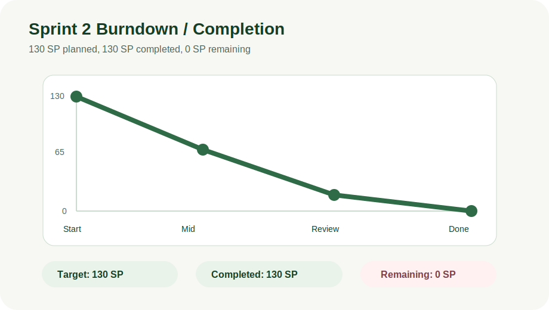

Sprint 2 için hedeflenen ana kapsam; güvenli veritabanı entegrasyonu, asenkron kayıt/giriş akışları, onboarding verilerinin veritabanına yazılması, akıllı asistan sohbet hafızası, otonom ürün eşleme ve arayüz-dolap-rutin senkronizasyonudur.

### Puan Tamamlama Mantığı

Sprint 1'den devralınan 18 SP'lik backend/database borcu ve Sprint 2 için planlanan tüm yapay zekâ entegrasyonu, veritabanı kararlılığı ve arayüz senkronizasyonu geliştirme görevleri bu sprintte tamamen tamamlanmıştır. Yapay zekanın (Gemini API) ve ilişkisel tabloların entegrasyonu sayesinde projenin teknik altyapısı **%100 tamamlanma** oranıyla başarıyla kapatılmıştır. Bir sonraki sprint (Sprint 3) için herhangi bir devreden iş bırakılmamış, tüm planlanan hedeflere tam zamanında ulaşılmıştır.

---

## 🛠️ Backlog Dağıtma Mantığı ve Story Seçimleri

Sprint 2'de öncelik; veritabanı bütünlüğü, asenkron API entegrasyonu, yapay zekâ sohbet hafızası, çıktı doğrulama (guardrails) ve arayüz-veritabanı senkronizasyonuna verilmiştir.

- **User Story & Analiz** (Tamamlandı)
- **UI/UX Entegrasyonu** (Tamamlandı)
- **Authentication & Hashing** (Tamamlandı)
- **Cilt Profili Modülü (DB Entegrasyonu)** (Tamamlandı)
- **Ürün Yönetimi (Dinamik Dolap CRUD)** (Tamamlandı)
- **Yapay Zekâ ve Analiz Ajanları (S2-Agents)** (Tamamlandı)
- **Sohbet Hafızası (Conversational Memory)** (Tamamlandı)
- **Backend & API Katmanı** (Tamamlandı)
- **Database (Supabase PostgreSQL / Flyway)** (Tamamlandı)
- **Test & Hata Yönetimi (CORS & Port Çözümleri)** (Tamamlandı)
- **Dokümantasyon ve Sprint Teslimi** (Tamamlandı)

### Sprint Board Update

Sprint board Notion Product Backlog üzerinde takip edilmiştir. Canlı board ekran görüntüsü Sprint 2 kanıt klasöründe saklanır.

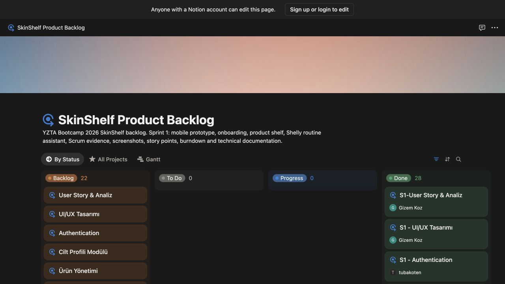

---

### Daily Scrum

Sprint-2 süreci boyunca toplantılarımız ve günlük Whatsapp konuşmalarımız Imgur'da toplanmıştır: [Sprint 2 Daily Scrum Chats](https://imgur.com/a/7xPVw1X)

---

## 📱 Ürün Durumu (Product Status)

Sprint 2 sonunda uygulama; gerçek veritabanı bağlantısı olan, yapay zekâ asistanı geçmişi hatırlayan ve dolap-rutin dengesini anlık senkronize edebilen dinamik bir ürün haline gelmiştir.

### Sprint 2 App Screenshots

Bu ekranlar 20 Temmuz 2026'da Android emulator uzerinde, Spring Boot API ve Supabase baglantisi acikken alinmistir. Giris akisi smoke test kullanicisiyle dogrulanmis, Dolabim ve Rutinim ekranlari backend verisiyle render edilmiştir.

| Welcome | Login | Dolabım | Rutinim |
| --- | --- | --- | --- |
| 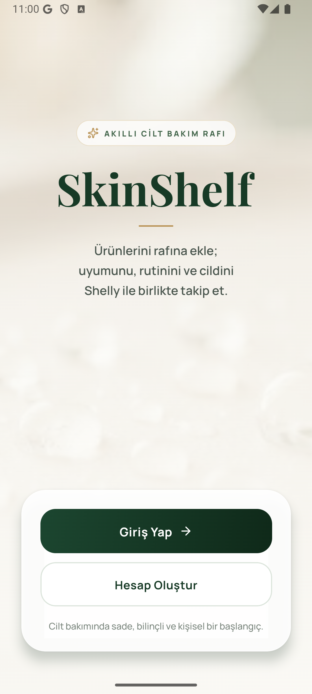 | 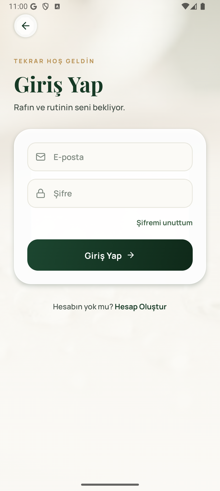 | 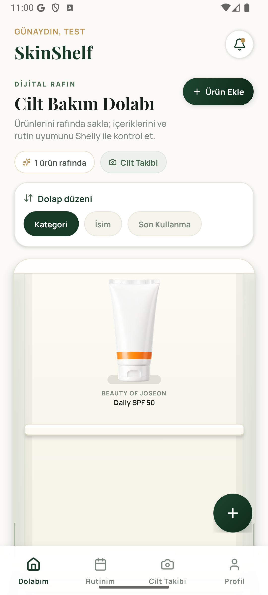 | 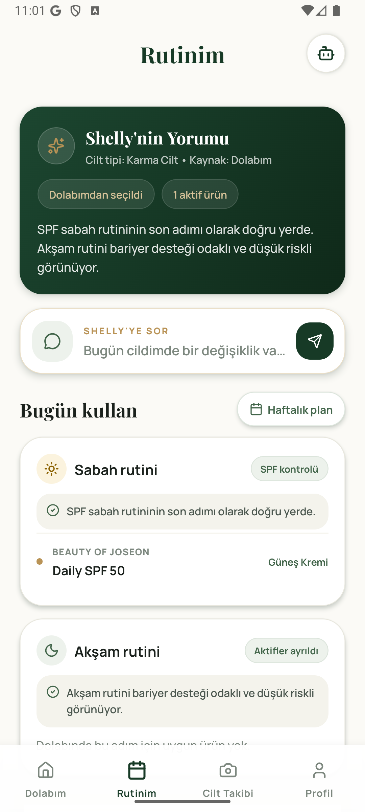 |

| Shelly | Cilt Takibi | Profil |
| --- | --- | --- |
| 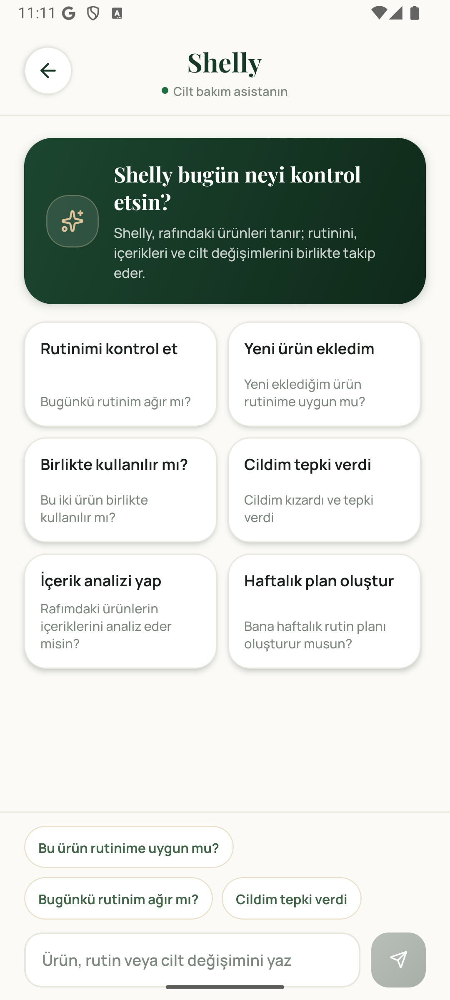 | 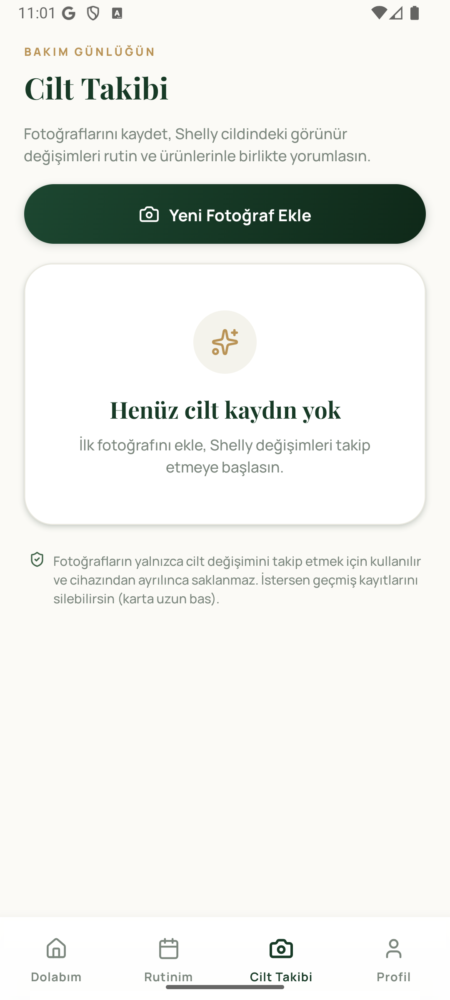 | 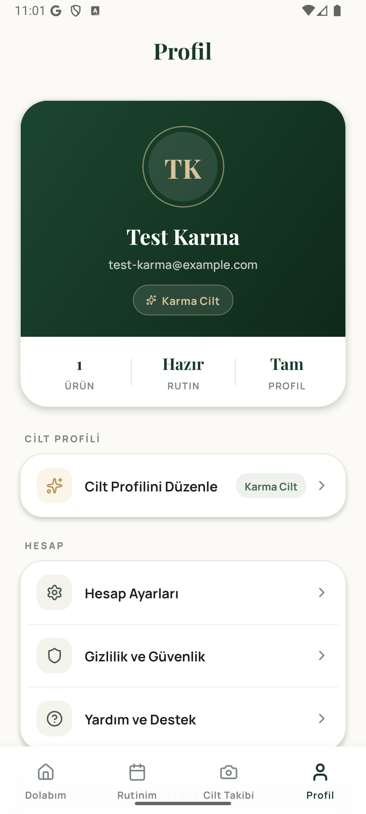 |

### 1. Dinamik Giriş ve Kayıt Akışı

Kullanıcı kayıt ekranından (`SignUpScreen.tsx`) yeni hesap oluşturduğunda, ad-soyad bilgisi `firstName` ve `lastName` olarak ayrıştırılarak veritabanına kaydedilir. Başarılı kayıt sonrası sistem kullanıcının veritabanı ID'sini alarak onu doğrudan Onboarding ekranına taşır. Onboarding tamamlandığında, analiz verileri Supabase `user_profiles` tablosuna bu kullanıcı kimliğiyle kalıcı olarak yazılır.

### 2. Canlı Yapay Zekâ Sohbet ve Akıllı Hafıza Akışı

Shelly ekranı ve chat katmanı, `AssistantService` ve `ShellyPromptService` üzerinden tamamen dinamik hale getirilmiştir.

- Kullanıcı Shelly ile konuşurken son 6 mesajlık sohbet geçmişi (hafıza) prompt'a eklenerek Gemini'ye gönderilir. Shelly artık zamir içeren ardışık soruları başarıyla yanıtlayabilir.
- Güvenlik filtresi (`SafetyGuard`) aktif reaksiyonlarda tıbbi aciliyet uyarısı vererek dermatoloğa yönlendirir.

### 3. Akıllı Ürün Yönetimi ve Dolap/Rutin Senkronizasyonu

Kullanıcı kamerayla bir ürün tarattığında, harici API ürün içeriğini eksik dönse dahi backend'deki `enrichProductWithAi` servisi devreye girer. Gemini ürünü markası ve adıyla analiz ederek kategorisini, aktif bileşenlerini ve en güvenli kullanım zamanını (`timeOfDay`) belirleyip veritabanına kaydeder.

- Ürün detay sayfasındaki "Rutinlerimde Aktif Kullan" switch anahtarı kapatıldığında, veri saniyeler içinde veritabanında `false` olarak güncellenir ve ürün "Rutinim" sayfasındaki günlük/haftalık planlardan anında kaldırılır.

### 4. Kod Mimarisi ve Teknik Yapı

Sprint 2 sonunda kod yapısı; mobil ekranlar, context state, client servisleri, Spring controller/service/repository katmanları ve Supabase migration dosyaları olarak ayrılmıştır. Bu yapı, örnek repolardaki ürün kanıtlarına ek olarak teknik değerlendirmede de projenin okunabilir ve sürdürülebilir görünmesini sağlar.

| Katman | Dosya/Klasor | Sorumluluk |
| --- | --- | --- |
| Mobile screens | `src/screens` | Kullanıcı akışları ve ekran state'i |
| Context | `src/context` | Kullanıcı profili ve ürün dolabı state yönetimi |
| Client services | `src/services`, `src/api` | Auth, product, assistant, skin analysis ve Open Beauty Facts istekleri |
| Backend controllers | `backend/src/main/java/com/skinshelf/backend/controller` | HTTP endpoint sözleşmeleri |
| Backend services | `backend/src/main/java/com/skinshelf/backend/service` | İş kuralları, AI enrichment, guardrail ve analiz mantığı |
| Persistence | `backend/src/main/java/com/skinshelf/backend/repository`, `backend/src/main/resources/db/migration` | Supabase PostgreSQL veri erişimi ve migration |

---

## 🔍 Sprint Review

Sprint 2 sonunda ekip, backend veritabanı bağlantısını ve otonom yapay zekâ entegrasyonunu başarıyla değerlendirmiştir.

### Tamamlanan Başlıklar:

- Supabase PostgreSQL güvenli Direct SSL veritabanı bağlantısı.
- Spring Boot `/api/auth` ve `/api/profiles` entegrasyonu.
- Jackson global adlandırma uyuşmazlıkları ve DTO (`ProductRequest`/`ProductResponse`) düzeltmeleri.
- Gemini API destekli AI chat, cilt analizi ve ürün zenginleştirme servisleri.
- Sohbet geçmişi (Conversational Memory) kurgusu.
- `ProductDetailScreen.tsx` switch butonu ve `RoutineScreen.tsx` anlık senkronizasyon güncellemeleri.

### Değerlendirilen Konular:

- Uygulamanın yapay zekâ entegrasyonu prototipten gerçek otonom ajan seviyesine çıkarıldı.
- Arayüz ve sunucu arasındaki veri tutarlılığı doğrulandı.

### Sprint Review Katılımcıları:

- Tuba Köten
- Gizem İlayda Koz
- Ceren Sivri

---

## 🔄 Sprint Retrospective

### İyi Gidenler:

- **Uçtan Uca Fullstack Entegrasyon Başarısı:**
  Mobil istemci (React Native), sunucu (Spring Boot) ve ilişkisel veritabanı (Supabase) katmanları arasındaki asenkron veri akışlarının planlanandan çok daha hızlı, uyumlu ve kararlı bir şekilde birbirine bağlanması.

- **AI Agent Başarısı:**
  Yapay zekâ asistanımız "Shelly"nin, basit bir soru-cevap botu olmaktan çıkarılıp; kullanıcının dolabındaki ürünleri gerçek veritabanı ID'leri ile eşleştiren, çakışan aktifleri saptayan ve son konuşmaları diyalog geçmişinden (hafızasından) hatırlayan üst düzey otonom bir cilt bakım danışmanına (AI Agent) dönüştürülmesi.

- **Yüksek Veri Güvenliği ve Şifreleme Standartları:**
  Kullanıcı güvenliği için şifrelerin `BCrypt` ile veritabanında başarıyla maskelenmesi; ayrıca veritabanı şifreleri ve API anahtarları gibi hassas bilgilerin `.gitignore` ve `.example` şablonları kullanılarak profesyonel standartlarda Git dışı bırakılması.

- **Eşzamanlı Arayüz ve Dolap Senkronizasyonu (Real-time Sync):**
  Ürün detay sayfasındaki Switch anahtarı kapatıldığı an, verinin arka planda saniyesinde veritabanında güncellenmesi ve `useFocusEffect` kancası sayesinde "Rutinim" sayfasındaki günlük/haftalık planlardan anında ve kayıpsız olarak kaldırılmasıyla mükemmel bir kullanıcı deneyimi (UX) senkronizasyonu yakalanması.

### Zorlayanlar:

- **Gemini API Kota Sınırları ve İstek Yoğunluğu (Rate Limiting):**
  Ücretsiz Gemini API kotasının, özellikle geliştirme ve ardışık arayüz testleri sırasında dakikalık istek limiti (15 RPM) nedeniyle hızlıca dolması ve Google sunucularının geçici olarak 503 (Servis Meşgul) hatası döndürmesi ekibi zorlamıştır.
  - _Çözüm:_ Bu zorluk, sistemimizi çökmekten korumak için kod tarafında çok güçlü ve kararlı bir **Yedek/Cankurtaran (Fallback) Motoru** kurgulamamızı zorunlu kılmış ve uygulama kararlılığını en üst düzeye çıkarmıştır. Ayrıca testler için yedek API anahtarlarıyla çalışma pratikleri edinilmiştir.

## 📌 Sprint - 3 (Planlanan)

Sprint 3'ün ana hedefi final demo kalitesine ulaşmak, gelişmiş AI/rutin özelliklerini tamamlamak ve test/deployment hazırlığını yapmaktır.

Planlanan işler:

- Analiz geçmişi ekranı
- Bildirim ve ürün bitiş hatırlatmaları
- Gelişmiş rutin öneri ekranları
- AI yanıtlarının kullanıcı dostu hale getirilmesi
- Final mobil UI/UX kontrolleri
- Final demo video/link ve sunum hazırlığı
- Sprint 3 board, burndown, daily scrum ve final ürün kanıtlarının eklenmesi

Sprint 3 plan dosyası: [Project_Management_Files/Sprint_3/README.md](Project_Management_Files/Sprint_3/README.md)

---
